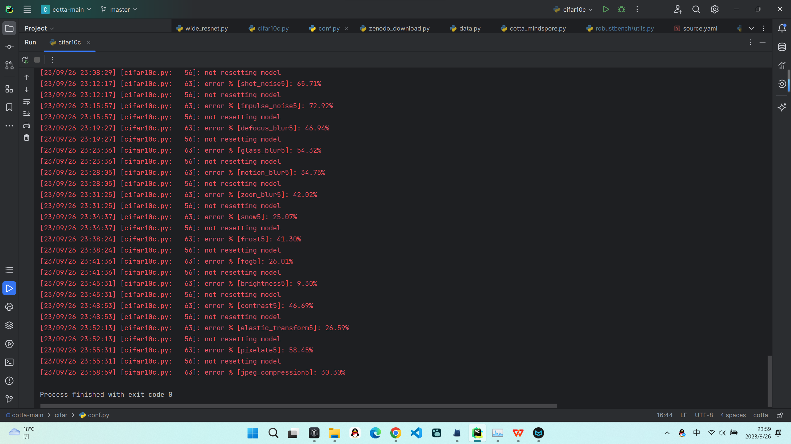
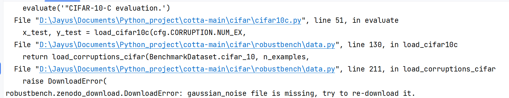

# 复现结果

source model运行结果，复现了论文结果，对应表格如下（列举部分）：

| 结果对比                    | Gaussian | shot  | impulse | defocus | glass | motion | zoom  | snow  | frost |
| ----------------------- | -------- | ----- | ------- | ------- | ----- | ------ | ----- | ----- | ----- |
| 本机复现-mindspore CPU版本（%） | 72.33    | 65.71 | 72.92   | 46.94   | 54.32 | 34.75  | 42.02 | 25.07 | 41.30 |
| 论文结果（%）                 | 72.3     | 65.7  | 72.9    | 46.9    | 54.3  | 34.8   | 42.0  | 25.1  | 41.3  |

输出结果：



[运行日志文件](https://github.com/TL-UESTC/cotta_mindspore/blob/master/source_230926_230500.txt)

# MSAdapter 简介

- 手动进行代码级别的修改容易出错，可以使用msadapter库进行转化，只需要修改导入部分的代码，再修改训练流程，然后针对运行过程中出现的bug对应修改即可。
  
  - [启智社区官方出品MSAdapter](https://openi.pcl.ac.cn/OpenI/MSAdapter)
  
  - 转换流程：
  
  - 其中模型加载只能加载模型的权重，还不能加载模型结构，但是本项目中模型结构已经定义了
  
  - 简介
    
    - MSAdapter仓库仍在维护，最近更新时间：2023-9-26
    - MSAdapter是将PyTorch训练脚本高效迁移至MindSpore框架执行的工具，其目的是在不改变原有PyTorch用户的使用习惯情况下，使得PyTorch代码能在昇腾上获得高效性能。
    - [MSAdapter使用指南](https://openi.pcl.ac.cn/OpenI/MSAdapter/src/branch/master/USER_GUIDE.md)
  
  - 使用时无需修改网络结构，相对比与手动修改还需要修改网络结构
  
  - 但是使用时需要修改训练脚本，使之适应mindspore的训练，示例如下：
    
    ```python
    # pytorch版本代码
    net = LeNet().to(config_args.device)
    optimizer = torch.optim.SGD(net.parameters(), lr=0.01, momentum=0.9, weightdecay=0.0005)
    net.train()
    # 数据迭代训练
    for i in range(epochs):
       for X, y in train_data:
           X, y = X.to(config_args.device), y.to(config_args.device)
           out = net(X)
           loss = criterion(out, y)
           optimizer.zero_grad()
           loss.backward()
           optimizer.step()
           print("------>epoch:{}, loss:{:.6f}".format(i, loss))
    ```
    
    ```python
    # mindspore 代码
    import msadapter.pytorch as torch
    import mindspore as ms
    
    net = LeNet().to(config_args.device)
    optimizer = torch.optim.SGD(net.parameters(), lr=0.01, momentum=0.9, weight_decay=0.0005)
    
    # 定义前向过程
    def forward_fn(data, label):
        logits = net(data)
        loss = criterion(logits, label)
        return loss, logits
    
    # 反向梯度定义
    grad_fn = ms.ops.value_and_grad(forward_fn, None, optimizer.parameters, has_aux=True)
    
    # 单步训练定义
    def train_step(data, label):
        (loss, _), grads = grad_fn(data, label)
        optimizer(grads)
        return loss
    
    net.train()
    # 数据迭代训练
    for i in range(epochs):
        for X, y in train_data:
            X, y = X.to(config_args.device), y.to(config_args.device)
            res = train_step(X, y)
            print("------>epoch:{}, loss:{:.6f}".format(i, res.numpy()))
    ```
    
    - 其中前向过程通常包含了模型网络接口调用以及损失函数调用，反向求导过程包含了反向梯度接口调用以及优化器接口调用部分，此外，MindSpore不需要调用`loss.backward()`以及`optimizer.zero_grad()`
  
  - [MSAdapterModelZoo](https://openi.pcl.ac.cn/OpenI/MSAdapterModelZoo) 提供了多个使用msadapter转换的经典模型，**并且给出了torch和msadapter的对应代码**，十分方便比对

# Q&A

- [原项目GitHub仓库网址](https://github.com/qinenergy/cotta)

- autoattack和robustbench无法加载
  
  - 在pycharm中将cifar设置为source root
  - 安装对应版本的autoattack：`pip install git+https://github.com/fra31/auto-attack.git@9b264b52bb65c373373727f532865a5551ab9c02#egg=autoattack`
  - ~~cotta 项目使用`robustbench@v0.1`~~
  - 将导入修改之后，无需安装robustbench

- 在存在data目录的前提下，其中缺少 Gaussian_noise 等文件时，会报Download error
  
  - 应该删除data目录，重新运行代码下载，或者自行下载解压
  
  - 
  
  - 

- 作者官方给出的链接中，不使用代理无法下载
  
  - 
  - ```python
    proxy = {
    "http": "http://127.0.0.1:7890",
    "https": "http://127.0.0.1:7890",
    }
    ```
  - 加上代理参数之后，可以成功下载

- 使用conda安装mindspore之后，运行时scipy会报错
  
  - [参考链接-StackOverflow](https://stackoverflow.com/questions/54083514/how-to-fix-importerror-dll-load-failed-the-specified-procedure-could-not-be-f)
  - `conda remove scipy,numpy`
  - `pip install numpy`
  - `pip install scipy`

- numpy1.24版本以后删除了np.float，使用msadapter会报错（如果是默认安装的mindspore）
  
  - 退回1.23.5
  - `pip install numpy==1.23.5`

- 权重文件加载
  
  - 本项目中保存的standard.pt中不止包含state_dict，还有一些其他的信息，比如epoch等，但是实际上加载权重无需这些信息
    - 所以可以先使用pytorch原生的load函数将state_dict读取出来，再用msadapter提供的save函数保存，之后再加载就正常了
  - 另外使用mindspore加载这些信息时，如果包含其他信息也会报错
  - 还需要注意mindspore和pytorch的网络参数名也有区别，如果直接加载pytorch的网络权重会报错
    - 比如weight对应gamma，bias对应beta等
  - msadapter支持直接加载pytorch的权重文件，但是不支持加载网络结构（本项目中网络结构已定义）
  - 直接加载权重文件到base model时可以正常加载，但是通过base model加载进cotta时会报错，正在debug *2023-9-26*